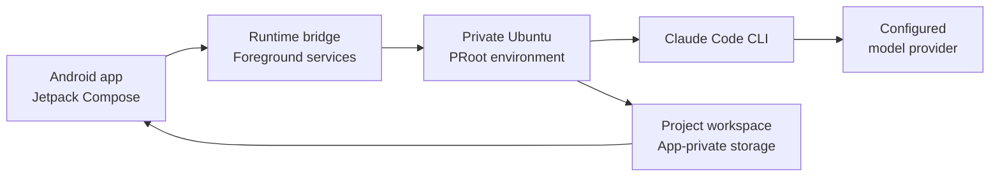

<div align="center">

# 🚀 Mobile Harness

### A local-first AI development workspace for Android

Chat with a coding agent, inspect files, run Linux commands, review changes, and preview local web apps—without installing Termux.

[](#project-status)
[](https://github.com/techjarves/Mobile-Harness/releases/latest)
[](#requirements)
[](#build-from-source)
[](#how-it-works)
[](#distribution-and-google-play)
[](LICENSE)

</div>

> [!IMPORTANT]
> Mobile Harness is an experimental alpha for ARM64 Android devices. Its PRoot environment is not a hardened security sandbox. Open only projects you own or trust, and do not use the app for sensitive or untrusted code.

## Overview

Mobile Harness brings a practical coding workspace to an Android phone. The Android interface stays beginner-friendly while an app-private Ubuntu environment runs the command-line tools behind it.

The app currently provides:

- Persistent projects and instantly created **Quick Projects**
- Multi-session AI chat with streamed responses and tool activity
- A workspace-scoped Linux terminal
- A collapsible file browser and local attachment storage
- File diffs, task checkpoints, and rollback controls
- A browser-style preview for local web servers
- Guided runtime installation with live logs and recovery
- Configurable Anthropic-compatible model providers

## Download

Signed direct APK builds are published under [GitHub Releases](https://github.com/techjarves/Mobile-Harness/releases):

| Release | Version | Asset | Architecture | Target SDK |
| --- | --- | --- | --- | --- |
| **Latest** | [**v1.0.2**](https://github.com/techjarves/Mobile-Harness/releases/tag/v1.0.2) | [`mobile-harness-v1.0.2.apk`](https://github.com/techjarves/Mobile-Harness/releases/download/v1.0.2/mobile-harness-v1.0.2.apk) | ARM64 (`arm64-v8a`) | API 28 (PRoot runtime compatible) |

> [!TIP]
> Always verify that your device meets the [minimum requirements](#requirements) (ARM64 Android device with at least 4 GB RAM).

## Product experience

| Area | What users can do |
| --- | --- |
| **Projects** | Create named workspaces, start Quick Projects, rename, delete, export, and resume recent work. |
| **Chat** | Ask the agent to explain, create, edit, or test code while following tool activity in real time. |
| **Files** | Browse the real workspace tree, open files, collapse folders, and access saved attachments. |
| **Terminal** | Run commands directly inside the active project or use the global Linux terminal. |
| **Changes** | Review diffs, keep a completed task, or restore its checkpoint. |
| **Preview** | Open loopback URLs in a restricted WebView, enter a local URL, and refresh the page. |
| **Settings** | Configure the AI connection, appearance, optional toolchains, and Linux runtime. |

Quick Projects use friendly, collision-safe workspace names such as `curious-turing` or `bright-lovelace`. They use the same chat, files, terminal, changes, and preview experience as regular projects.

## How it works



1. Mobile Harness checks that the phone is ARM64 and has enough memory and storage.
2. The first-run installer downloads verified runtime components into app-private storage.
3. Ubuntu runs through PRoot without Android root access or a separate terminal application.
4. Claude Code runs in structured streaming mode and reports responses and tool events to the Android UI.
5. Commands and file operations run inside the active project workspace.

The first setup can take 10–12 minutes depending on the device and network. A foreground service keeps setup active, exposes live sanitized logs, and reports progress through an Android notification when permission is available.

## Runtime and toolchains

The core setup includes:

- Ubuntu 20.04 ARM64 root filesystem
- Claude Code CLI, downloaded from Anthropic's official distribution endpoint
- Node.js and npm
- Git, certificates, and essential shell utilities

Optional toolchains can be selected during setup or managed later:

| Toolchain | Included tools |
| --- | --- |
| **Web** | Node.js, npm, JavaScript, and TypeScript workflows |
| **Python** | Python 3, pip, venv, and build essentials |
| **Android** | OpenJDK and Kotlin-oriented build tools |
| **C / C++** | GCC, G++, Make, CMake, and GDB |
| **PHP** | PHP CLI and Composer |

Docker, systemd, nested containers, kernel modules, Android emulators, and workflows requiring real root are outside the supported scope.

## AI providers

Mobile Harness is designed around Claude Code's Anthropic-compatible API path.

| Connection | Status |
| --- | --- |
| **Anthropic API** | Primary supported API-key configuration |
| **LLMrouter** | Anthropic-compatible gateway; compatibility depends on the selected model |
| **Custom API** | Experimental support for Anthropic-compatible endpoints and model discovery |
| **OpenAI gateway** | Experimental; requires a compatible Pocket gateway |
| **Kimi gateway** | Experimental; requires a compatible Pocket gateway |

API keys are encrypted with an Android Keystore-backed AES key before local persistence. They must still be treated as exposed to any trusted code deliberately executed in the same on-device environment.

Mobile Harness does not offer Claude.ai subscription login in public third-party builds unless Anthropic explicitly approves that authentication path. Provider support does not guarantee that every model implements all Claude Code tools or streaming events correctly.

## Requirements

| Requirement | Minimum | Recommended |
| --- | --- | --- |
| **Android** | Android 9 (API 28) | Android 13 or newer |
| **Architecture** | ARM64 (`arm64-v8a`) | ARM64 |
| **Memory** | 4 GB RAM | 8 GB RAM |
| **Storage** | 2 GB free for the core runtime | More space for projects and optional toolchains |
| **Network** | Required for initial setup and AI access | Stable Wi-Fi for setup |

32-bit Android devices are not supported. Android may still stop long-running or memory-intensive work despite foreground execution and wake-lock safeguards.

## Build from source

### Prerequisites

- Android Studio with Android SDK 36
- JDK 17
- Android NDK and CMake 3.22.1
- An ARM64 Android device or emulator
- ADB for command-line installation

### Build and install

```bash
git clone https://github.com/techjarves/Mobile-Harness.git
cd Mobile-Harness

./gradlew assembleDebug
adb install -r app/build/outputs/apk/debug/app-debug.apk
```

Useful verification commands:

```bash
./gradlew testDebugUnitTest
./gradlew lintDebug
```

The standard direct-APK build currently targets API 28 for compatibility with its local native runtime. An API 36 Play-oriented build can be produced with:

```bash
./gradlew -PplayBuild=true assembleDebug
```

That build flag configures API 36 and ARM64-only output. See the [Google Play release checklist](docs/PLAY_STORE_CHECKLIST.md) for signing and policy work that must still be completed.

## First-run flow

1. Review the device compatibility check.
2. Review notification and background-execution explanations.
3. Select the core runtime and any optional toolchains.
4. Keep the installer open or follow progress from its foreground notification.
5. Choose an AI provider, enter credentials, discover or enter a model, and test the connection.
6. Create a project or start a Quick Project.

Notification permission and battery-optimization exemption improve background reliability, but denial does not permanently block the app.

## Project structure

```text
app/src/main/
├── java/com/jarves/mh/
│   ├── data/       Preferences, encrypted credentials, and persistence
│   ├── model/      Projects, chats, attachments, and runtime events
│   ├── runtime/    Installer, Claude bridge, terminal, and services
│   └── ui/         Jetpack Compose screens and state management
├── cpp/            Native launcher and process bridge
├── assets/         Runtime metadata and third-party notices
└── res/            Android resources
```

## Security and privacy

- Runtime files, projects, conversations, attachments, checkpoints, and diagnostics are stored locally in app-private storage.
- Selected local folders are imported through Android's Storage Access Framework rather than exposing all shared storage.
- Runtime downloads are pinned and checksum-verified before execution.
- Permanent backend credentials must never be embedded in the APK.
- PRoot performs userspace path translation; it is **not** a container, virtual machine, or hardened security boundary.
- Imported code can attempt to access credentials and data available to its process. Use only trusted repositories and files.

Release builds must not contain test API keys, debug provider defaults, or private endpoints.

## Known limitations

- ARM64 phones only
- No hardened isolation for hostile code
- Terminal input/output currently uses a process bridge rather than a complete PTY emulator; full-screen interactive programs may render incorrectly
- Background tasks are subject to Android process and battery policies
- Custom providers may lack Claude-compatible thinking, tool use, token counting, or streaming behavior
- Large builds can be slow and memory-intensive under PRoot
- Runtime installation requires a substantial download and free storage

## Distribution and Google Play

Mobile Harness is distributed as a signed direct APK via [GitHub Releases](https://github.com/techjarves/Mobile-Harness/releases) for private testing and direct sideloading.

The Play-oriented build now targets API 36, emits ARM64-only native code, supports 16 KB page alignment, uses upload-key signing, and includes the required store metadata and declaration worksheets. Submission still requires Play Console enrollment, listing declarations, reviewer access, pre-launch testing, and approval of the downloadable local-runtime architecture. A future Play edition may need to package approved runtime assets differently or move execution to a remote service.

Public release is also conditional on legal review and written guidance from Anthropic regarding branding, authentication, and redistribution.

## Project status

Mobile Harness is under active development and should be treated as alpha software. Interfaces, runtime versions, provider behavior, and storage formats may change while reliability and device compatibility are validated.

## Legal and third-party software

Mobile Harness is an independent project and is not affiliated with, endorsed by, or sponsored by Anthropic.

Claude and Claude Code are trademarks of Anthropic. Claude Code is proprietary software, is downloaded from Anthropic rather than bundled or mirrored by this repository, and remains subject to Anthropic's terms and license. Ubuntu, Android, Kotlin, Node.js, Git, and other components belong to their respective owners.

Third-party notices bundled with the Android application are available in [`app/src/main/assets/licenses`](app/src/main/assets/licenses).

## License

Mobile Harness is available under the [MIT License](LICENSE). Third-party components remain governed by their own licenses.

---

<div align="center">
  <sub>Built for developers who want a capable coding workspace in their pocket.</sub>
</div>
