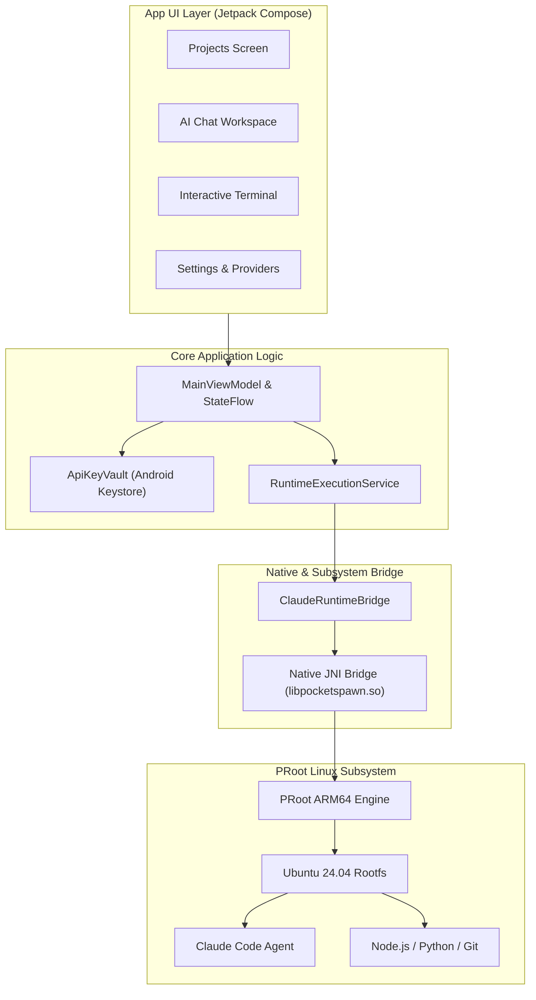

# 🚀 Pocket Dev

<p align="center">
  <strong>Autonomous AI Coding Agent & Full Linux Development Environment on Android</strong>
</p>

<p align="center">
  <a href="https://kotlinlang.org/"></a>
  <a href="https://developer.android.com/jetpack/compose"></a>
  <a href="https://developer.android.com/about/versions/pie"></a>
  <a href="https://ubuntu.com/"></a>
  <a href="#license"></a>
</p>

---

## 📌 Overview

**Pocket Dev** brings a full-stack, local AI software engineering environment directly to your mobile device. By combining an embedded **ARM64 Ubuntu PRoot runtime** with autonomous coding agents (such as **Claude Code** and custom LLM providers), Pocket Dev enables you to code, build, test, and run real projects on your phone—without needing Termux, root access, or remote server dependencies.

```
┌──────────────────────────────────────────────────────────┐
│                   Pocket Dev Mobile UI                   │
│      [ Projects ]   [ AI Chat ]   [ Terminal ]           │
└────────────────────────────┬─────────────────────────────┘
                             │ JNI / Process Bridge
┌────────────────────────────▼─────────────────────────────┐
│              PRoot Sandboxed Linux Subsystem             │
│   Ubuntu 24.04 ARM64 · Node.js · Python · Git · Clang    │
├──────────────────────────────────────────────────────────┤
│             Autonomous Agent Execution Engine            │
│       Claude Code / OpenAI / OpenRouter / Custom         │
└──────────────────────────────────────────────────────────┘
```

---

## ✨ Key Features

### 🤖 Autonomous Coding Agent
- **Native Claude Code Bridge**: Downloads and orchestrates Claude Code directly within the on-device Linux runtime using streaming JSON IPC.
- **Multi-Provider AI Gateway**: Seamlessly connect to **Anthropic** (Claude 3.5 / 3.7 Sonnet, Opus), **OpenRouter**, **OpenAI** (GPT-4o, o3-mini), **Kimi / Moonshot**, or custom endpoints.
- **Human-in-the-Loop Safety**: Granular approval cards for file writes, modifications, and command execution.
- **Live Activity Streaming**: Real-time thinking disclosures, tool executions, and step-by-step progress tracking.

### 🐧 On-Device Linux Environment
- **Zero-Configuration PRoot**: Private ARM64 Ubuntu 24.04 environment configured automatically during onboarding.
- **Native Process Spawn Bridge**: High-performance C++/JNI process management (`libpocketspawn.so`) bypassing Android SELinux execution constraints.
- **Full Linux Terminal**: Interactive terminal emulator with quick-command chips, virtual modifier keys (`CTRL`, `ALT`, `ESC`, `TAB`), and direct project session targeting.
- **Extensible Toolchains**: Built-in installer for Node.js, Python 3, Rust, Go, Git, and build essentials.

### 🛠️ Developer Workspace & Tools
- **Project Hub**: Create named projects or launch rapid scratchpad sessions with one tap.
- **Live File Explorer**: Real-time project directory view synchronized with AI agent workspace modifications.
- **In-App Live Preview**: Integrated preview container for local web servers, static sites, and development ports.
- **Foreground Execution**: Continuous background compilation and agent reasoning via Android Foreground Services.

### 🔒 Privacy & Security
- **Hardware-Backed Security**: API keys and sensitive tokens are encrypted using the **Android Keystore** (`MasterKeys` / AES-GCM-256).
- **On-Device Storage**: Project files, logs, and development dependencies remain strictly isolated in app-private sandbox storage.
- **Adaptive Theming**: Full Material 3 dynamic styling with dedicated **Dark** and **Light** modes.

---

## 🏗️ Architecture

Pocket Dev is built on a clean, modern Android architecture using Kotlin Coroutines, StateFlow, and Jetpack Compose:



---

## 📱 Supported Providers

Pocket Dev supports dynamic model discovery and validation across major LLM APIs:

| Provider | Supported Models | Authentication |
| :--- | :--- | :--- |
| **Anthropic** | Claude 3.7 Sonnet, Claude 3.5 Sonnet, Claude 3.5 Haiku, Claude 3 Opus | API Key / Subscription |
| **OpenRouter** | DeepSeek R1/V3, Llama 3.3 70B, Qwen 2.5 Coder, Claude, etc. | API Key |
| **OpenAI** | GPT-4o, GPT-4o-mini, o1, o3-mini | API Key |
| **Moonshot / Kimi** | Moonshot-v1 (8k / 32k / 128k), Kimi-latest | API Key |
| **Custom OpenAI / Anthropic** | Any self-hosted or proxy endpoint (vLLM, Ollama, LiteLLM) | Custom Base URL + Key |

---

## 🚀 Getting Started

### Prerequisites
- **Android Device**: ARM64-v8a architecture, Android 9.0+ (API 28+).
- **Free Storage**: At least ~1.5 GB of free internal storage for the Ubuntu rootfs and developer toolchains.
- **RAM**: 4 GB minimum (6 GB+ recommended for large project workflows).

### Building from Source

1. **Clone the Repository**:
   ```bash
   git clone https://github.com/techjarves/PocketDev.git
   cd PocketDev
   ```

2. **Setup Build Environment**:
   - Ensure **JDK 17** or higher is installed and configured in `JAVA_HOME`.
   - Ensure the Android SDK with NDK and CMake `3.22.1` is installed.

3. **Compile the Debug APK**:
   ```bash
   ./gradlew assembleDebug
   ```

4. **Run Unit Tests**:
   ```bash
   ./gradlew testDebugUnitTest
   ```

5. **Install on Connected Device via ADB**:
   ```bash
   adb install -r app/build/outputs/apk/debug/app-debug.apk
   ```

---

## 📂 Project Structure

```
PocketDev/
├── app/
│   ├── src/
│   │   ├── main/
│   │   │   ├── cpp/                    # Native C++ process spawn routines
│   │   │   │   ├── CMakeLists.txt
│   │   │   │   └── pocketspawn.cpp
│   │   │   ├── java/dev/pocket/app/
│   │   │   │   ├── data/               # Keystore vault & persistent preferences
│   │   │   │   │   ├── ApiKeyVault.kt
│   │   │   │   │   └── AppPreferences.kt
│   │   │   │   ├── model/              # Domain models, states, & event definitions
│   │   │   │   │   └── Models.kt
│   │   │   │   ├── network/            # Model discovery & validation HTTP client
│   │   │   │   │   └── ProviderApiClient.kt
│   │   │   │   ├── runtime/            # PRoot runtime installer & Claude agent bridge
│   │   │   │   │   ├── ClaudeRuntimeBridge.kt
│   │   │   │   │   ├── NativeSpawnProcess.kt
│   │   │   │   │   ├── RuntimeExecutionService.kt
│   │   │   │   │   └── RuntimeInstaller.kt
│   │   │   │   └── ui/                 # Jetpack Compose UI & ViewModels
│   │   │   │       ├── MainViewModel.kt
│   │   │   │       ├── MarkdownText.kt
│   │   │   │       ├── PocketDevApp.kt
│   │   │   │       ├── SettingsScreenModern.kt
│   │   │   │       ├── TerminalScreen.kt
│   │   │   │       └── theme/
│   │   │   └── res/                    # Vector icons, drawables, & strings
│   └── build.gradle.kts
├── gradle/
├── build.gradle.kts
└── settings.gradle.kts
```

---

## 🛡️ Security Considerations

- **PRoot Isolation**: PRoot runs as a userland process translation layer. While it isolates your project workspace within app-private storage, it is not a kernel-enforced hypervisor sandbox. Only open projects and execute scripts from trusted sources.
- **Permission Boundaries**: Pocket Dev requests only necessary foreground service and notification permissions to keep terminal commands and AI agent tasks alive without background termination.

---

## 🤝 Attribution & Acknowledgements

- **PRoot Project**: User-space `chroot` implementation enabling Linux userspace on Android.
- **Termux**: Inspiration and packaging standards for Android-adapted Linux tools.
- **Claude Code**: Advanced agentic coding interface by Anthropic.
- **ferrumclaudepilgrim/claude-code-android**: Valuable research on verified download pipelines and PRoot smoke-testing strategies on mobile.

---

## 📄 License

This project is licensed under the **MIT License**. See the [LICENSE](LICENSE) file for details.
