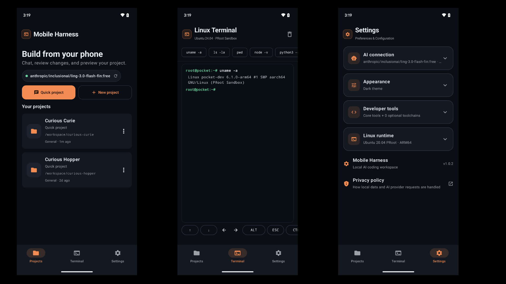
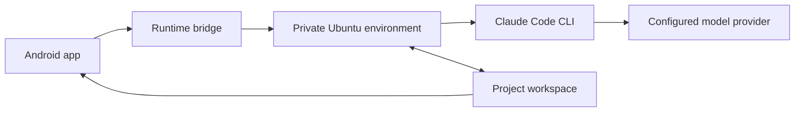
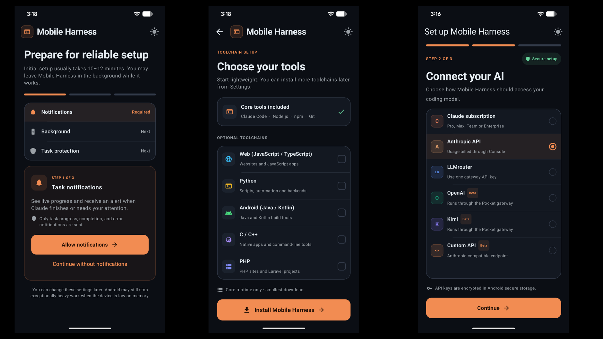

<div align="center">

# Mobile Harness

### A complete AI development workspace, built for Android.

Chat with a coding agent, edit files, run Linux commands, review changes, and preview local web apps—all from your phone.

[](https://github.com/techjarves/Mobile-Harness/releases/latest)
[](#requirements)
[](LICENSE)

[Download](https://github.com/techjarves/Mobile-Harness/releases/latest) · [Watch the demo](https://youtu.be/QzAau52Z7yQ) · [Build from source](#build-from-source)

</div>

<br />

<p align="center">
  
</p>

> [!IMPORTANT]
> Mobile Harness is alpha software for ARM64 Android devices. Its PRoot environment is not a hardened security sandbox. Only open projects you own or trust.

## Your development environment, in your pocket

Mobile Harness pairs a native Jetpack Compose interface with a private Ubuntu environment. The result is a focused mobile workspace that feels approachable on the surface and runs real development tools underneath—without root access or a separate Termux installation.

| | |
| --- | --- |
| **AI workspace** | Stream responses and tool activity across persistent chat sessions. |
| **Real terminal** | Run Linux commands inside the active project workspace. |
| **File workflow** | Browse, edit, attach, and organize files without leaving the app. |
| **Safe iteration** | Inspect diffs, keep completed work, or restore a checkpoint. |
| **Live preview** | Open local web servers in a restricted, browser-style WebView. |
| **Quick Projects** | Start instantly with a friendly, collision-safe workspace name. |

## How it works



The first-run installer downloads and verifies the runtime inside app-private storage. Ubuntu then runs through PRoot, while foreground Android services connect the interface to the coding agent, terminal, project files, and local preview.

Core runtime:

- Ubuntu 20.04 ARM64
- Claude Code CLI from Anthropic's official distribution endpoint
- Node.js, npm, Git, certificates, and essential shell utilities

Optional toolchains add Python, Android/JVM, C/C++, or PHP development support. Docker, systemd, nested containers, kernel modules, emulators, and workflows requiring real root are not supported.

## Install

Download the latest signed APK from [GitHub Releases](https://github.com/techjarves/Mobile-Harness/releases/latest).

The current repository version is **v1.0.2** and produces an ARM64 (`arm64-v8a`) APK. Android may ask you to allow installation from your browser or file manager.

### Requirements

| | Minimum | Recommended |
| --- | --- | --- |
| **Android** | Android 9 / API 28 | Android 13 or newer |
| **Architecture** | ARM64 | ARM64 |
| **Memory** | 4 GB RAM | 8 GB RAM |
| **Storage** | 2 GB free | Additional space for projects and toolchains |
| **Network** | Required for setup and AI access | Stable Wi-Fi for first-time setup |

The initial setup usually takes 10–12 minutes, depending on the device and network. Live logs, recovery controls, and an optional foreground notification keep the process visible.

## First run

<p align="center">
  
</p>

1. Complete the device compatibility check.
2. Choose the core runtime and any optional toolchains.
3. Let Mobile Harness install and verify the environment.
4. Configure an AI provider, model, and credentials.
5. Create a named project or launch a Quick Project.

Notification permission and a battery-optimization exemption improve reliability for long-running work, but neither is required to enter the app.

## Model providers

Mobile Harness uses Claude Code's Anthropic-compatible API path.

| Provider | Support |
| --- | --- |
| **Anthropic API** | Primary API-key configuration |
| **LLMrouter** | Supported through its Anthropic-compatible gateway |
| **Custom API** | Experimental endpoint and model discovery |
| **OpenAI / Kimi gateway** | Experimental; requires a compatible Pocket gateway |

Credentials are encrypted locally with an Android Keystore-backed AES key. Compatibility still depends on the chosen model correctly implementing the tool-use and streaming behavior expected by Claude Code.

## Build from source

You will need Android Studio with Android SDK 36, JDK 17, Android NDK 26.1.10909125, CMake 3.22.1, and ADB.

```bash
git clone https://github.com/techjarves/Mobile-Harness.git
cd Mobile-Harness

./gradlew assembleDebug
adb install -r app/build/outputs/apk/debug/app-debug.apk
```

Run the project checks with:

```bash
./gradlew testDebugUnitTest
./gradlew lintDebug
```

The direct APK targets API 28 to preserve the proven local runtime path. For the Play-oriented API 36 build:

```bash
./gradlew -PplayBuild=true assembleDebug
```

See the [Google Play release checklist](docs/PLAY_STORE_CHECKLIST.md) for signing, policy, and submission requirements.

## Project layout

```text
app/src/main/
├── java/com/jarves/mh/
│   ├── data/       Preferences, encrypted credentials, and persistence
│   ├── model/      Projects, chats, attachments, and runtime events
│   ├── runtime/    Installer, agent bridge, terminal, and services
│   └── ui/         Jetpack Compose screens and state management
├── cpp/            Native launcher and process bridge
├── assets/         Runtime metadata and third-party notices
└── res/            Android resources
```

## Security and privacy

- Projects, conversations, attachments, checkpoints, and diagnostics remain in app-private storage.
- Imported folders use Android's Storage Access Framework instead of broad shared-storage access.
- Runtime downloads are pinned and checksum-verified before execution.
- Release builds must not contain test credentials, private endpoints, or debug provider defaults.
- PRoot provides userspace path translation—not container, VM, or hardened sandbox isolation.

Read the full [privacy policy](PRIVACY.md).

## Current limitations

- ARM64 devices only
- No hardened isolation for untrusted code
- Full-screen terminal programs may render incorrectly because the process bridge is not a complete PTY emulator
- Android battery and process policies can interrupt background work
- Custom providers may not implement every required thinking, tool-use, token-counting, or streaming behavior
- Large builds can be slow and memory-intensive under PRoot

## Project status

Mobile Harness is under active development and should be treated as alpha software. Interfaces, runtime versions, provider behavior, and storage formats may change as device support and reliability improve.

Direct APK releases are intended for private testing and sideloading. Google Play distribution still depends on store review, policy declarations, pre-launch testing, and approval of the downloadable runtime architecture.

## Legal

Mobile Harness is an independent project and is not affiliated with, endorsed by, or sponsored by Anthropic.

Claude and Claude Code are trademarks of Anthropic. Claude Code is downloaded from Anthropic rather than bundled or mirrored by this repository and remains subject to Anthropic's terms and license. Ubuntu, Android, Kotlin, Node.js, Git, and other components belong to their respective owners. Third-party notices are available in [`app/src/main/assets/licenses`](app/src/main/assets/licenses).

## License

Released under the [MIT License](LICENSE). Third-party components remain governed by their respective licenses.

<br />

<div align="center">
  <sub>Built for developers who want a capable workspace wherever they are.</sub>
</div>
